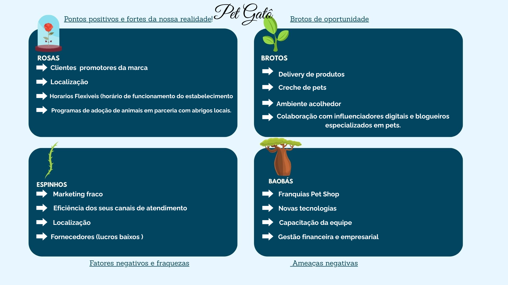
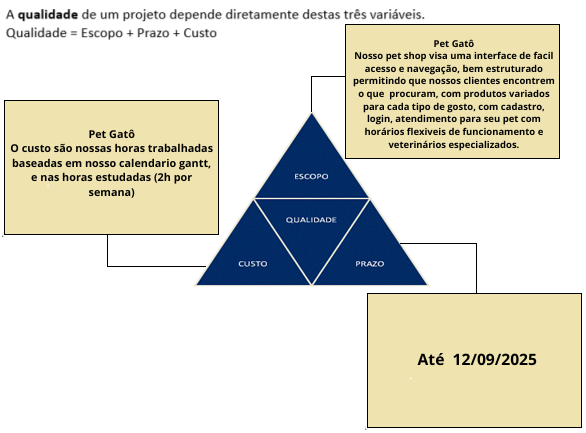
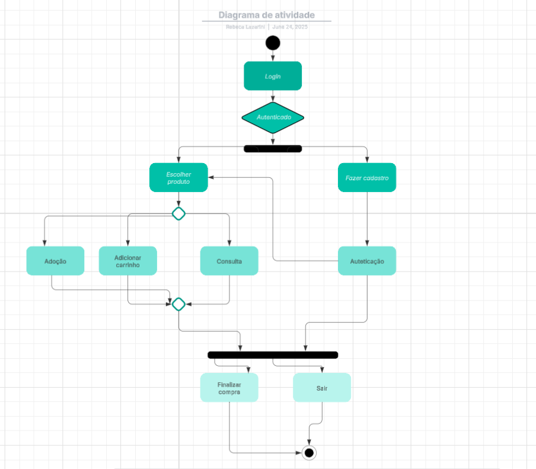

# tcc Pet Shop

# link [figma](https://www.figma.com/proto/wWW07z8xzHFdYYDbozFACe/Untitled?node-id=106-2403&p=f&t=WdfHVLg9q538pfCj-1&scaling=scale-down&content-scaling=fixed&page-id=0%3A1&starting-point-node-id=14%3A155)
## Tecnologias
- IDE (VsCode)
- JavaScript
- Prisma 
- Mysql
## Como executar
- Clone este repositório
- Abra com VsCode
- - Abra o terminal ctrl + '
- Execute esse comando
```bash
cd back-end
cd api
```
- Crie o arquivo . env dentro da pasta api com a seguintes variaveis de ambiente:
````bash
EMAIL_USER=seu-email@gmail.com
EMAIL_PASS=sua-senha
SECRET_JWT=meu_segredo_jwt
DATABASE_URL="mysql://root@localhost:3306/fullstack?timezone=UTC"
````
- Caso ja exista, exclua o arquivo .env e crie um
  
- Instale as dependencias nessa ordem
- Caso tenha a pasta migrations em prisma/migrations exclua ela e execute as dependencias
- Não esqueça que se tiver um banco de dados com o nome cadastro em seu mysql é importante excluir para poder funcionar as depndencias
```bash
npm i
npx prisma migrate dev --name init
npx nodemon server.js

```

## Teste no insomnia 
- Você pode testar tanto no insomnia quanto na própria tela de cadastro e consulta no fron-end
- Users
```bash
 http://localhost:3000/u
 exemplo:
{
  "email": "teste@exemplo.com",
  "senha": "123456"
}
```

- Cadastro do Pet
```bash
 http://localhost:3000/c
 exemplo:
{
"id": 1,
"nomepet": "Rex",
"especie": "cachorro",
"raca": "Labrador",
"nomeproprietario": "João Silva",
"datanascpet": "2022-04-25T00:00:00.000Z",
"email": "joao.silva@example.com",
"alergia": "Nenhuma"
}
```


## Sprint inicial
- Metodologia: KANBAN
- Papéis e responsabilidades: Rebeca Lazarini: Front-end, Larissa Santos: Back-end, Evelyn Fernandes: Banco de dados, Larissa Rocha: Teste e Crislaine Leopoldo: Documentação
- O objetivo do nosso site de pet shop é oferecer uma experiência online de fácil acesso e navegação, com uma interface intuitiva e dinâmica. As telas serão funcionais e bem organizadas, permitindo que os clientes encontrem rapidamente os produtos e serviços que procuram, além de possibilitar um processo de compra simples e eficiente.


## Gráfico gant
 [Gráfico aqui](https://wellifabio.github.io/gantt/) anual (260 dias)

|PetGatô Swot (fofa)|
|:-:|
||

|Exemplo PetShop Tiangulo de ferro|
|:-:|
||

|DC|
|:-:|
|.png)|

|Diagrama de atividadas|
|:-:|
||
