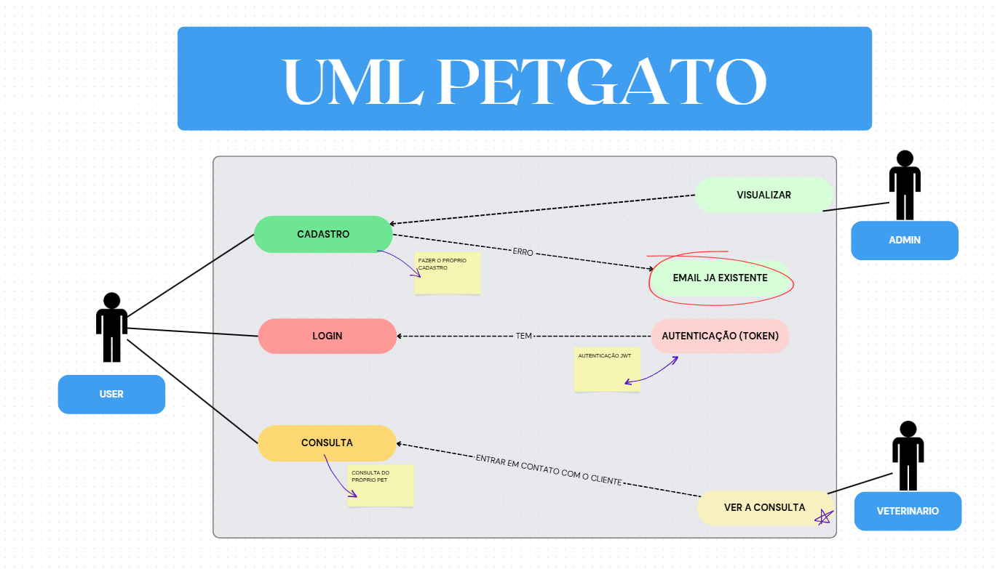
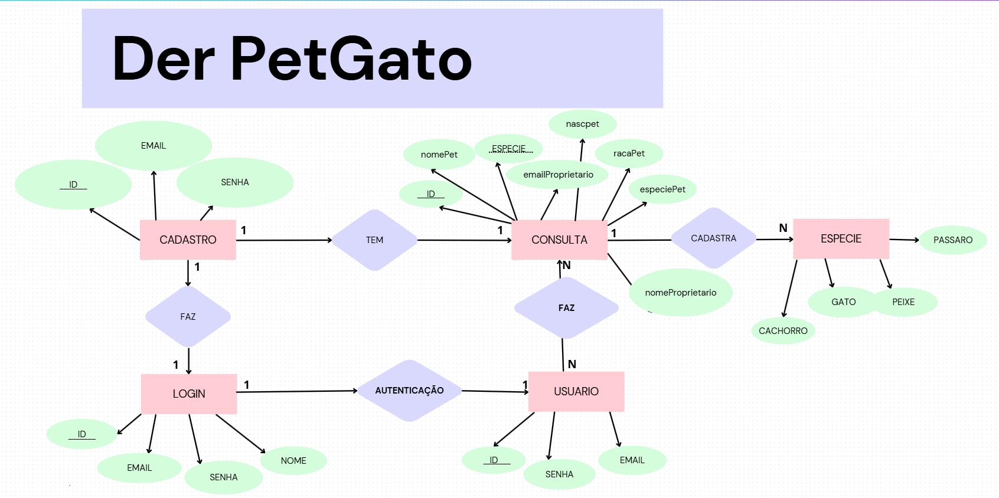

# tcc Pet Shop

[petgato mobile](https://github.com/larissadossantosdarocha/tcc)

## Tecnologias
- IDE (VsCode)
- JavaScript
- Prisma 
- Mysql
- Autenticação JWT
## Como executar
- Clone este repositório
- Abra com VsCode
- - Abra o terminal ctrl + '
- Execute esse comando
```bash
cd back-end
cd api
```
- Crie o arquivo . env dentro da pasta api com a seguintes variaveis de ambiente:
````bash
SECRET_JWT=meu_segredo_jwt
DATABASE_URL="mysql://root@localhost:3306/fullpetgato?timezone=UTC"
````
- Caso ja exista, exclua o arquivo .env e crie um
  
- Instale as dependencias nessa ordem
- Caso tenha a pasta migrations em prisma/migrations exclua ela e execute as dependencias
- Não esqueça que se tiver um banco de dados com o nome cadastro em seu mysql é importante excluir para poder funcionar as dependencias
```bash
npm i
npx prisma migrate dev --name init
npx nodemon server.js

```

## Teste no insomnia 
- Você pode testar tanto no insomnia quanto na própria tela de cadastro e consulta no fron-end
- Users
```bash
 http://localhost:3000/usuarios
 exemplo:
{
  "email": "teste@exemplo.com",
  "senha": "123456"
}
```

- Cadastro do Pet
```bash
 http://localhost:3000/consultas
 exemplo:
{
"id": 1,
"nomepet": "Rex",
"especie": "cachorro",
"raca": "Labrador",
"nomeproprietario": "João Silva",
"datanascpet": "2022-04-25T00:00:00.000Z",
"email": "joao.silva@example.com",
"alergia": "Nenhuma"
}
```


## Sprint inicial
- Metodologia: KANBAN
- Papéis e responsabilidades: Rebeca Lazarini: back-end, Larissa Santos: front-end, Evelyn Fernandes: Banco de dados, Larissa Rocha: Testes/relatórios e Crislaine Leopoldo: Documentação.
- O objetivo do nosso site de pet shop é oferecer uma experiência online de fácil acesso e navegação, com uma interface intuitiva e dinâmica. As telas serão funcionais e bem organizadas, permitindo que os clientes encontrem rapidamente os produtos e serviços que procuram, além de possibilitar um processo de compra simples e eficiente.


## Gráfico gant
 [Gráfico aqui](https://wellifabio.github.io/gantt/) anual (260 dias)

|PetGatô Swot (fofa)|


- Exemplo PetShop Tiangulo de ferro



 ## Relatório de testes
  [relatorio caixa preta](Relatório%20Back-end.pdf)
  [relatorio caixa branca](Relatório%20Back-end.pdf)
  [relatorio ront-end](relatorio%20de%20front.pdf)

- Requisitos funicionais
- Clientes/Usuários
  - RF01: O sistema deve permitir o cadastro e login de clientes (nome, email, senha).
  - RF02: O cliente pode cadastrar seus pets (nome, espécie, raça, data de nascimento).
- Produtos e Compras
  - RF03: O sistema exibe o catálogo de produtos por categorias (cachorro, gato, peixe e pássaro.)
  -  RF04: O cliente pode adicionar e remover produtos do carrinho de compras.
- Agendamento de Serviços
  - RF05: O cliente pode agendar serviços (banho e tosa, veterinário) selecionando data, hora e pet.
- Administração (Back-end)
  - RF10: O administrador deve poder gerenciar o estoque (adicionar/remover produtos, atualizar quantidades).
  - RF11: O administrador deve poder visualizar e confirmar os agendamentos de serviços.
  - RF12: O sistema deve gerar um token para o login por 30min.
  - RF13: O sistema deve criptografar a senha dos usuários.

- Requisitos não funcionais 
- Desempenho
  - RNF01: A página inicial e as páginas de produtos carregam no máximo 3 segundos, mesmo com 500 usuários simultâneos.
  - RNF02: O processamento de uma transação de pagamento deve ser concluído em no máximo 5 segundos.
- Usabilidade
  - RNF03: A navegação do site é intuitiva, permitindo que o usuário encontre um produto em no máximo 3 cliques.
  - RNF04: O site está responsivo, funcionando perfeitamente em dispositivos móveis (smartphones e tablets).
- Segurança
  - RNF05: Todos os dados de login e pagamento devem ser transmitidos usando o protocolo de segurança JWT. 
- Escalabibidade
  - RNF06: O sistema deve ser capaz de suportar um aumento de 100% no volume de pedidos durante períodos promocionais (ex: Black Friday) sem degradação do desempenho.
- Tecnológicos
  - RNF7: O sistema deve ser compatível com os navegadores web mais recentes (Chrome, Firefox, Safari e Edge).
  - RNF8: O site deve integrar-se com o serviço de API do Correios para cálculo de frete. Ou ter um frete fixo pra todas as compras.

